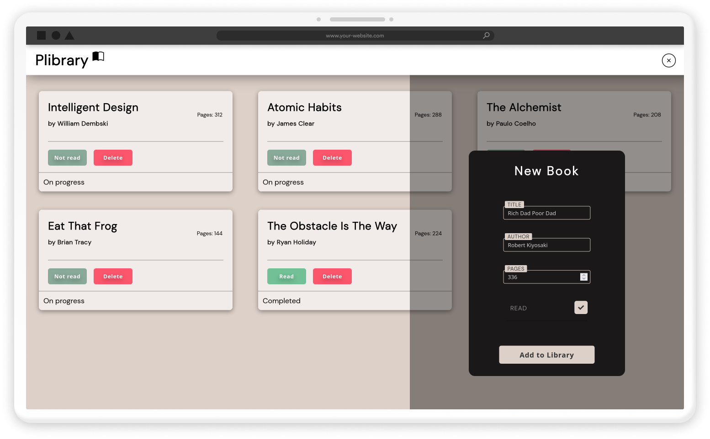
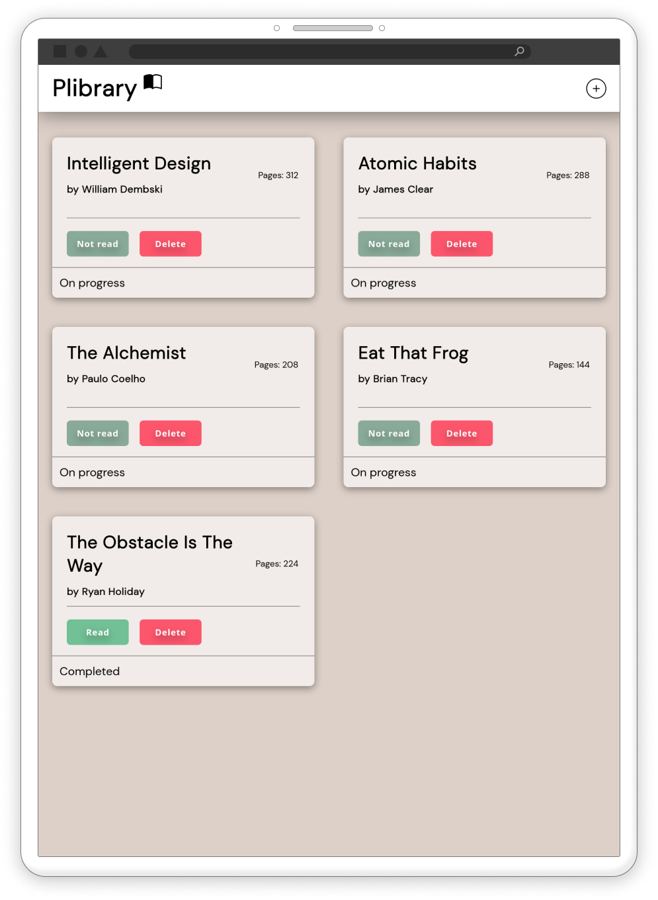
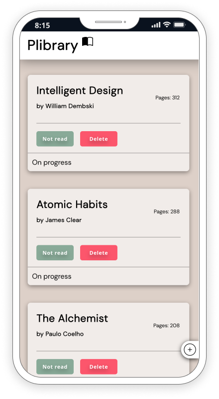

 

## **Installation**

> **Note** 
>> [A live deployment of `Plibrary` is available on GitHub pages](https://0xabdulkhalid.github.io/plibrary/)

For those that would like to run the application and/or edit its source code on their local computer, follow the steps below:

1. Clone the repository with `git clone https://github.com/0xabdulkhalid/plibrary` or download it as a `.zip` file and extract it.
2. Navigate to where the repository is saved on your local machine and open up its `index.html` file on your preferred web browser.

 

## **Usage**

- To add a book to your library, click on the "Add Book" button in order to open up a modal 
- Fill up the form within such, inputting data related to the book that you'd like to track
- After clicking save, you should then see the book appear in your library.
- Then you can mark it as read or unread, and to delete from book-tracking.

 

## **Preview**

| Desktop        |
| :-------------: |
|     |

| Tablet | Mobile |
| :-----: | :-----: |
|  |  |

 

## **Outcome**

* Used HTML5 **semantic elements** for better accessability and readability
* Saves user's books in **local storage** which helps to retrive after refresh
* Comes with lightweight **User Interface** with friendly **User Experience**
* Site was built responsive via **Mobile first workflow**
* **Cross tested** on Firefox and Chromium based browsers

 

## **What I learned**

* Usage of **checkbox's :checked** property to achieve form's pop-out without javascript need
* Effectively utilized the usage of ES6's classes which helps to write less lines of code (instead of Prototyping in Js)
* Quick hack of **static** declaration for **class's methods** to call it without **initialization** of object
* Utilization of **localStorage** mechanism of **Web Storage**
* A lot of minor things

 

## **Built With**

-    
-    
- 

 

## **Tools Used**

-    
-  
-    

 

## **Contributing**

Feel free to submit an issue should a bug be found using the application. One is also welcome to make a pull request should they seek to make a major change or introduce a new feature.

 

## **License**

- [MIT License](https://github.com/0xabdulkhalid/plibrary/blob/main/LICENSE)
- Copyright **©** 2023 - [0xabdulkhalid](https://github.com/0xabdulkhalid/)

 

## **Contact**

 &nbsp;&nbsp;&nbsp;

 